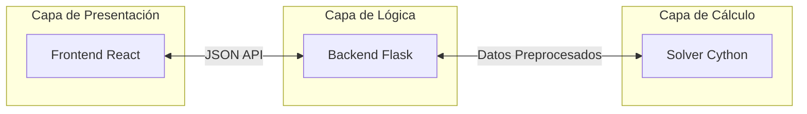

# Sistema de Generación Automática de Horarios (UTP)

> **Universidad Politécnica de Victoria**  
> Ingeniería en Tecnologías de la Información e Innovación Digital

Este sistema resuelve el **University Course Timetabling Problem (UTP)**, automatizando la asignación de horarios académicos mediante algoritmos de optimización. Diseñado para manejar múltiples restricciones institucionales y maximizar la eficiencia en la distribución de recursos docentes.

---

## 👥 Equipo de Desarrollo

| Integrante | Rol |
|------------|-----|
| **César Euresti** | Desarrollador |
| **Junior Arturo Vázquez Leonel** | Desarrollador |
| **Diego Eduardo Zapata Aguilar** | Desarrollador |
| **Elías de Jesús Zúñiga de León** | Desarrollador |

---

## 🎯 Objetivo del Proyecto

Automatizar la creación de horarios para la carrera de ITI, reduciendo el tiempo de planificación de semanas a minutos, garantizando:
- **Cero conflictos** de horario para profesores y grupos.
- **Cumplimiento estricto** de cargas horarias y competencias.
- **Optimización** de huecos y tiempos muertos.

## 🏗️ Arquitectura del Sistema

El sistema implementa una arquitectura de tres capas para separar responsabilidades y maximizar el rendimiento.



## 🛠️ Stack Tecnológico

| Capa | Tecnologías |
|------|-------------|
| **Frontend** | React 18, TypeScript, Vite, Tailwind CSS, shadcn/ui |
| **Backend** | Python 3, Flask, Flask-CORS |
| **Solver** | Cython (Alto Rendimiento), NumPy |
| **Calidad** | ESLint, Prettier, Vitest |

## 🧩 Modelo de Datos y Restricciones

El problema se modela como un grafo de restricciones donde se deben satisfacer condiciones **Duras** (obligatorias) y **Suaves** (deseables).

### Restricciones Duras
1.  **Disponibilidad**: El profesor debe estar libre en el slot asignado.
2.  **Unicidad**: Un profesor o grupo no puede estar en dos lugares a la vez.
3.  **Competencias**: El profesor debe ser apto para la materia.
4.  **Carga Máxima**: No exceder 15 horas/semana por docente.
5.  **Contigüidad**: Bloques de 2 horas deben ser consecutivos.

### Algoritmo de Solución
Utilizamos un enfoque **Greedy con Heurísticas** optimizado en Cython:
- **Day Rotation**: Distribuye la carga equitativamente entre los días de la semana.
- **Professor Load Balancing**: Evita saturar a los primeros profesores de la lista.
- **Backtracking (Opcional)**: Para búsqueda exhaustiva en casos complejos.

## 🚀 Instalación y Ejecución

### Requisitos Previos
- Node.js 18+
- Python 3.10+
- Compilador C (gcc/clang) para Cython

### Quick Start

```bash
# 1. Instalar dependencias (Frontend y Backend)
npm install

# 2. Iniciar sistema completo (Frontend + Backend)
npm start
```

El sistema estará disponible en:
- **Frontend**: `http://localhost:3000`
- **Backend API**: `http://localhost:5000`

### 📊 Visualización de Grafos

El sistema incluye una potente herramienta de visualización basada en **Python** que permite explorar el grafo de restricciones de manera interactiva.

**Tecnologías:**
- `PyQt6`: Interfaz gráfica de escritorio.
- `NetworkX`: Cálculos de grafo y layout.
- `PyVis`: Generación de visualizaciones web interactivas.

**Requisitos:**
- Conexión a Internet (para la primera ejecución e instalación de dependencias).
- Python 3.10+ instalado en el sistema.

**Ejecución:**

```bash
# Instala dependencias (automático) y lanza el visualizador
npm run visualize-graph
```

Esto abrirá una ventana de escritorio donde podrás ver los nodos (materias-hora), sus conexiones (restricciones) y exportar la vista a HTML interactivo.

---

<div align="center">
  <sub>Proyecto Final - Estructura de datos - 2025</sub>
</div>
