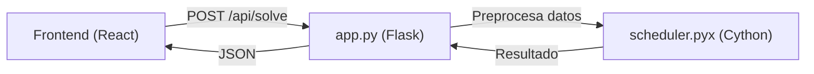

# UTP Timetabling — ITI

Aplicación web local para generar horarios de la carrera **ITI**. Todo corre en el navegador, sin backend.

## Dependencias clave
- React 18 + TypeScript + Vite + Tailwind + shadcn/ui  
- Estado: Zustand; Formularios: react-hook-form + zod  
- Tablas: @tanstack/react-table; Datos/async: @tanstack/react-query  
- Iconos: lucide-react; Gráficas: recharts  
- Tests: Vitest + React Testing Library  
- Solver: Python 3 (JSON in/out) en `solver/solve.py` con núcleo opcional Cython (`solver/core_fast.pyx`)

## Quick start
```bash
npm install
npm start        # Vite + BrowserSync en http://localhost:3000 (proxy a 5173)
# Alternativa: npm run dev (solo Vite en 5173)
# Comandos de soporte:
npm run lint     # ESLint
npm run test     # Vitest (jsdom)
npm run build    # tsc -b + vite build
```

## Qué incluye la UI
- Módulo 1: materias/grupos/turnos con import CSV y export JSON.  
- Módulo 2: profesores, competencias y matriz de disponibilidad 3 estados.  
- Módulo 3: generador con solver mock (TanStack Query), tablero “tetris” por grupo y métricas de compacidad/advertencias.
- Módulo 4 (gestor): import/export centralizados de CSV/JSON, seed grande (10 cuatrimestres, 2 grupos por cuatri).

# Backend del Generador de Horarios - Documentación Técnica

Este documento describe la arquitectura, estructuras de datos y algoritmos del backend del generador de horarios universitarios, implementado en **Cython** para alto rendimiento.

---

## Tabla de Contenidos

1. [Arquitectura General](#arquitectura-general)
2. [Estructuras de Datos](#estructuras-de-datos)
3. [Algoritmos](#algoritmos)
4. [Restricciones Implementadas](#restricciones-implementadas)
5. [Optimizaciones](#optimizaciones)
6. [API](#api)

---

## Arquitectura General

El backend consta de dos componentes principales:

| Archivo | Tecnología | Propósito |
|---------|------------|-----------|
| `app.py` | Flask + Python | API REST, preprocesamiento de datos |
| `scheduler.pyx` | Cython | Motor de scheduling de alto rendimiento |



---

## Estructuras de Datos

### 1. Node (Nodo)

Representa una **hora-clase** que debe ser asignada. Cada materia con N horas semanales genera N nodos.

```python
cdef class Node:
    cdef public str id              # Identificador único: "grupo-materia-unidad"
    cdef public str grupo_id        # ID del grupo estudiantil
    cdef public str materia_id      # ID de la materia
    cdef public int unit_index      # Índice de la hora (0, 1, 2...)
    cdef public list possible_assignments  # Lista de tuplas (día, slot, profesor)
    cdef public int assigned_day    # Día asignado (-1 si no asignado)
    cdef public int assigned_slot   # Slot asignado (-1 si no asignado)
    cdef public int assigned_prof   # Índice del profesor asignado (-1 si no)
```

**Ejemplo**: Una materia "Cálculo" con 4 horas semanales para el grupo "ISC-1A" genera 4 nodos:
- `ISC-1A-calculo-0`
- `ISC-1A-calculo-1`
- `ISC-1A-calculo-2`
- `ISC-1A-calculo-3`

### 2. GraphScheduler (Planificador)

Es la clase principal que contiene el estado del problema y los algoritmos de resolución.

#### Matrices de Estado (NumPy, O(1) lookup)

| Matriz | Dimensiones | Propósito |
|--------|-------------|-----------|
| `prof_schedule` | `[num_profs][5][9]` | 1 si profesor ocupado en (día, slot), 0 si libre |
| `group_schedule` | `[num_grupos][5][9]` | 1 si grupo ocupado en (día, slot), 0 si libre |
| `prof_load` | `[num_profs]` | Carga actual de cada profesor (horas asignadas) |
| `prof_max_load` | `[num_profs]` | Carga máxima permitida por profesor |
| `group_materia_day_count` | `[grupos][materias][5]` | Horas de materia X asignadas al grupo Y en día Z |
| `group_materia_day_slots` | `[grupos][materias][5]` | Bitmask de slots ocupados (para contigüidad) |
| `prof_assignment` | `[grupos][materias]` | Profesor asignado a cada par grupo-materia |
| `prof_assignment_count` | `[grupos][materias]` | Contador para manejar deshacer asignaciones |

#### Mapeos (Diccionarios)

| Diccionario | Propósito |
|-------------|-----------|
| `prof_to_idx` | ID de profesor → índice numérico |
| `group_to_idx` | ID de grupo → índice numérico |
| `materia_to_idx` | ID de materia → índice numérico |
| `idx_to_prof_id` | Índice → ID de profesor (reverso) |

#### Variables de Control de Tiempo

| Variable | Tipo | Propósito |
|----------|------|-----------|
| `start_time` | `double` | Timestamp de inicio |
| `time_limit` | `double` | Límite en segundos |
| `call_count` | `long long` | Contador de llamadas recursivas |
| `time_limit_reached` | `bint` | Bandera de abort |

---

## Algoritmos

### 1. Algoritmo Greedy (Voraz)

**Complejidad Temporal**: O(N × A) donde N = número de nodos, A = asignaciones posibles por nodo.

#### ¿Qué es el algoritmo Greedy?

El algoritmo **Greedy** (voraz) es una estrategia de resolución de problemas que toma decisiones **localmente óptimas** en cada paso, con la esperanza de que estas decisiones conduzcan a una solución global aceptable. En el contexto de la generación de horarios, el algoritmo intenta asignar cada hora-clase de manera secuencial, eligiendo siempre la **primera opción válida** que encuentre.

#### ¿Cómo funciona paso a paso?

1. **Ordenamiento inicial**: El sistema recibe una lista de "nodos" (horas-clase) que deben ser asignadas. Cada nodo representa una hora específica de una materia para un grupo determinado. Por ejemplo, si "Cálculo" tiene 4 horas semanales, se generan 4 nodos independientes.

2. **Iteración secuencial**: El algoritmo recorre cada nodo en orden. Para cada nodo, tiene una lista de "asignaciones posibles" que son combinaciones válidas de (día, horario, profesor).

3. **Selección de la primera opción válida**: Para cada nodo, el algoritmo prueba las asignaciones posibles una por una. La primera que pase todas las validaciones (profesor disponible, grupo libre, sin exceder cargas máximas, etc.) se aplica inmediatamente.

4. **Sin retroceso**: Una vez que se asigna un nodo, esa decisión es **permanente**. El algoritmo nunca vuelve atrás para cambiar una asignación anterior, incluso si esto causa que nodos posteriores no puedan ser asignados.

5. **Manejo de fallos**: Si ninguna asignación es válida para un nodo, simplemente se deja sin asignar y se genera una advertencia. El algoritmo continúa con el siguiente nodo.

#### Pseudocódigo detallado

```
función solve_greedy():
    Para i desde 0 hasta cantidad_de_nodos:
        nodo = nodos[i]
        grupo_idx = obtener_indice_grupo(nodo.grupo_id)
        materia_idx = obtener_indice_materia(nodo.materia_id)
        
        asignado = Falso
        
        Para cada (día, slot, profesor) en nodo.asignaciones_posibles:
            Si es_valido(nodo, grupo_idx, materia_idx, día, slot, profesor):
                aplicar_movimiento(nodo, grupo_idx, materia_idx, día, slot, profesor)
                asignado = Verdadero
                Salir del bucle interno
        
        Si NO asignado:
            # Este nodo queda sin asignar
            Registrar advertencia
    
    Retornar Verdadero  # Siempre "termina", aunque con huecos
```

#### Ejemplo ilustrativo

Supongamos que tenemos que asignar 3 horas de "Base de Datos" al grupo ISC-3A:

| Nodo | Opciones Disponibles | Decisión |
|------|---------------------|----------|
| BD-hora1 | (Lunes-s1-Prof.López), (Lunes-s2-Prof.García), (Martes-s1-Prof.López) | Elige Lunes-s1-Prof.López ✓ |
| BD-hora2 | (Lunes-s2-Prof.López), (Martes-s1-Prof.López), (Martes-s2-Prof.García) | Elige Lunes-s2-Prof.López ✓ (contiguo) |
| BD-hora3 | (Martes-s1-Prof.López), (Miércoles-s1-Prof.López) | Elige Martes-s1-Prof.López ✓ |

El Greedy tomó las primeras opciones válidas sin considerar si esto podría causar problemas más adelante.

#### Ventajas y Desventajas

| Ventajas | Desventajas |
|----------|-------------|
| ⚡ Muy rápido (milisegundos) | ❌ No garantiza solución óptima |
| 🎯 Determinista (mismo input = mismo output) | ❌ Puede quedarse atascado |
| 📊 Bajo consumo de memoria | ❌ No explora alternativas |
| ✅ Siempre termina | ❌ Sensible al orden de entrada |

---

### 2. Algoritmo Backtracking (Retroceso)

**Complejidad Temporal**: O(A^N) en el peor caso teórico, pero en la práctica es mucho menor gracias a las podas.

#### ¿Qué es el algoritmo Backtracking?

El algoritmo **Backtracking** es una técnica de búsqueda exhaustiva que explora el espacio de soluciones de forma sistemática. A diferencia del Greedy, el Backtracking **puede deshacer decisiones** cuando detecta que un camino no lleva a una solución válida. Es como resolver un laberinto: si llegas a un callejón sin salida, retrocedes y pruebas otro camino.

#### ¿Cómo funciona paso a paso?

1. **Estructura recursiva**: El algoritmo es una función que se llama a sí misma. Cada llamada intenta asignar un nodo específico (identificado por su índice).

2. **Caso base**: Si el índice del nodo es igual al total de nodos, significa que todos fueron asignados exitosamente. ¡Se encontró una solución completa!

3. **Exploración de opciones**: Para el nodo actual, el algoritmo prueba cada asignación posible (día, slot, profesor) una por una.

4. **Validación**: Antes de aplicar una asignación, verifica que cumpla todas las restricciones (las mismas 8 restricciones que usa el Greedy).

5. **Aplicar y recurrir**: Si la asignación es válida, la aplica (modifica las matrices de estado) y llama recursivamente a `backtrack(nodo_idx + 1)` para intentar asignar el siguiente nodo.

6. **Retroceso (Backtrack)**: Si la llamada recursiva retorna `False` (no se pudo completar la solución desde ese punto), el algoritmo **deshace** la asignación (restaura las matrices de estado) y prueba la siguiente opción.

7. **Agotamiento de opciones**: Si ninguna opción funciona para el nodo actual, retorna `False`, lo que causa que el nodo anterior también intente otra opción (efecto cascada).

#### La magia del "deshacer" (Undo)

El backtracking requiere poder **revertir** cada decisión. Para esto, cada vez que se aplica una asignación, se actualizan las matrices de estado:

**Aplicar movimiento (`apply_move`)**:
```
prof_schedule[profesor][día][slot] = 1        # Marcar profesor ocupado
group_schedule[grupo][día][slot] = 1          # Marcar grupo ocupado
prof_load[profesor] += 1                       # Incrementar carga
group_materia_day_count[grupo][materia][día] += 1
group_materia_day_slots[grupo][materia][día] |= (1 << slot)  # Bitmask
```

**Deshacer movimiento (`undo_move`)**:
```
prof_schedule[profesor][día][slot] = 0        # Liberar profesor
group_schedule[grupo][día][slot] = 0          # Liberar grupo
prof_load[profesor] -= 1                       # Decrementar carga
group_materia_day_count[grupo][materia][día] -= 1
group_materia_day_slots[grupo][materia][día] &= ~(1 << slot)  # Limpiar bit
```

#### Control de tiempo

Dado que el Backtracking puede tardar **horas o incluso días** en casos complejos, implementamos un sistema de límite de tiempo:

1. **Contador de llamadas**: Se incrementa `call_count` en cada llamada recursiva.

2. **Verificación periódica**: Cada 1000 llamadas, se compara el tiempo transcurrido contra el límite.

3. **Bandera de abort**: Si se excede el tiempo, `time_limit_reached = True`.

4. **Propagación inmediata**: Todas las funciones recursivas verifican esta bandera y retornan `False` inmediatamente, desenrollando la pila de llamadas en milisegundos.

5. **Mejor solución parcial**: Antes de abortar, el algoritmo guarda la mejor solución encontrada hasta el momento (la que asignó más nodos).

#### Pseudocódigo detallado

```
función backtrack(nodo_idx):
    call_count += 1
    
    # === CONTROL DE TIEMPO ===
    Si call_count % 1000 == 0:
        Si time_limit_reached:
            Retornar Falso
        Si tiempo_actual() - tiempo_inicio > limite_tiempo:
            Imprimir "Tiempo límite alcanzado"
            time_limit_reached = Verdadero
            Retornar Falso
    
    # === GUARDAR MEJOR SOLUCIÓN PARCIAL ===
    Si nodo_idx > max_assigned_count:
        max_assigned_count = nodo_idx
        best_assignments = copiar_estado_actual()
        Imprimir "Nueva mejor solución: {nodo_idx}/{total} asignaciones"
    
    # === CASO BASE: SOLUCIÓN COMPLETA ===
    Si nodo_idx >= cantidad_de_nodos:
        Retornar Verdadero  # ¡Éxito!
    
    # === VERIFICACIÓN DE ABORT ===
    Si time_limit_reached:
        Retornar Falso
    
    # === OBTENER NODO ACTUAL ===
    nodo = nodos[nodo_idx]
    grupo_idx = obtener_indice_grupo(nodo.grupo_id)
    materia_idx = obtener_indice_materia(nodo.materia_id)
    
    # === EXPLORAR TODAS LAS OPCIONES ===
    Para cada (día, slot, profesor) en nodo.asignaciones_posibles:
        
        # Verificar abort antes de cada intento
        Si time_limit_reached:
            Retornar Falso
        
        Si es_valido(nodo, grupo_idx, materia_idx, día, slot, profesor):
            
            # PASO 1: Aplicar la asignación
            aplicar_movimiento(nodo, grupo_idx, materia_idx, día, slot, profesor)
            
            # PASO 2: Recurrir al siguiente nodo
            Si backtrack(nodo_idx + 1):
                Retornar Verdadero  # Propagar éxito hacia arriba
            
            # PASO 3: Verificar si debemos abortar
            Si time_limit_reached:
                deshacer_movimiento(nodo, grupo_idx, materia_idx, día, slot, profesor)
                Retornar Falso
            
            # PASO 4: Deshacer y probar siguiente opción (BACKTRACK)
            deshacer_movimiento(nodo, grupo_idx, materia_idx, día, slot, profesor)
    
    # === NINGUNA OPCIÓN FUNCIONÓ ===
    Retornar Falso
```

#### Ejemplo ilustrativo: El poder del retroceso

Supongamos una situación donde el Greedy fallaría:

**Escenario**: 2 materias (A y B), 1 profesor común, solo 2 slots disponibles.
- Materia A: 1 hora, puede ir en slot 1 o slot 2
- Materia B: 1 hora, SOLO puede ir en slot 1

**Greedy** (falla):
1. Asigna A en slot 1 (primera opción válida)
2. Intenta asignar B... ¡slot 1 ocupado y no tiene otra opción!
3. Resultado: B queda sin asignar ❌

**Backtracking** (éxito):
1. Asigna A en slot 1
2. Intenta asignar B en slot 1... falla
3. **RETROCEDE**: Deshace A de slot 1
4. Asigna A en slot 2
5. Asigna B en slot 1... ¡éxito!
6. Resultado: Ambas materias asignadas ✓

#### Árbol de decisiones

El backtracking puede visualizarse como un árbol donde cada nivel representa un nodo por asignar:

```
                    [Inicio]
                       │
         ┌─────────────┼─────────────┐
         ▼             ▼             ▼
    [Nodo0-Op1]   [Nodo0-Op2]   [Nodo0-Op3]
         │             │             │
    ┌────┼────┐   ┌────┼────┐       ...
    ▼    ▼    ▼   ▼    ▼    ▼
  [N1-1][N1-2]  [N1-1][N1-2]
    │     X       │     │
    ▼             ▼     ▼
  [N2-1]       [N2-1] [N2-1]
    X             ✓     ...
```

- `✓` = Solución encontrada
- `X` = Callejón sin salida (backtrack)

El algoritmo recorre el árbol en **profundidad primero** (DFS), retrocediendo cuando encuentra un callejón sin salida.

#### Ventajas y Desventajas

| Ventajas | Desventajas |
|----------|-------------|
| ✅ Encuentra solución si existe | ⏱️ Puede ser muy lento |
| ✅ Explora todo el espacio de búsqueda | 📊 Mayor consumo de memoria (pila de llamadas) |
| ✅ Devuelve mejor solución parcial | 🔄 Complejidad exponencial teórica |
| ✅ Configurable con límite de tiempo | |

---

### Comparación: ¿Cuándo usar cada uno?

| Criterio | Greedy | Backtracking |
|----------|--------|--------------|
| **Tiempo disponible** | Poco (segundos) | Más (minutos) |
| **Importancia de completar** | Baja (ok con huecos) | Alta (necesito todo) |
| **Complejidad del problema** | Simple | Compleja |
| **Restricciones** | Pocas/relajadas | Muchas/estrictas |
| **Uso recomendado** | Vista previa rápida | Generación final |

---

## Restricciones Implementadas

### Restricciones Duras (Hard Constraints)

Estas **deben cumplirse** obligatoriamente:

| # | Restricción | Validación |
|---|-------------|------------|
| 1 | **Profesor no ocupado** | `prof_schedule[prof][día][slot] == 0` |
| 2 | **Grupo no ocupado** | `group_schedule[grupo][día][slot] == 0` |
| 3 | **Carga máxima de profesor** | `prof_load[prof] < prof_max_load[prof]` |
| 4 | **Consistencia de profesor** | El mismo profesor debe dar todas las horas de una materia al mismo grupo |
| 5 | **Máximo 2 horas/día por materia** | `group_materia_day_count[g][m][d] < 2` |
| 6 | **Contigüidad de bloques** | Si hay 2 horas de una materia en un día, deben ser consecutivas |
| 7 | **Máximo gap de 1 hora** | No puede haber huecos mayores a 1 slot entre clases del grupo |
| 8 | **Máximo 7 horas/día por grupo** | Previene días excesivamente largos |

### Validación de Contigüidad (Restricción 6)

Usa un **bitmask** para tracking eficiente:

```python
# Si ya hay una hora asignada en el día...
if count > 0:
    mask = group_materia_day_slots[grupo][materia][día]
    # Verificar que el nuevo slot sea adyacente a alguno existente
    adj_mask = (1 << (slot - 1)) | (1 << (slot + 1))
    if (mask & adj_mask) == 0:
        return False  # No es contiguo
```

### Validación de Gaps (Restricción 7)

Escanea todos los slots del día para detectar huecos:

```python
last_slot = -1
for s in range(9):
    if slot_ocupado(s):
        if last_slot != -1:
            gap = s - last_slot - 1
            if gap > 1:
                return False  # Gap demasiado grande
        last_slot = s
```

---

## Optimizaciones

### 1. Preprocesamiento en Python (app.py)

Antes de llamar al scheduler, se aplican dos heurísticas:

#### a) Rotación de Días

```python
# Cada materia empieza a buscar en un día diferente
start_day_idx = materia_global_idx % 5
day_order = days_list[start_day_idx:] + days_list[:start_day_idx]
```

Esto distribuye la carga entre días, evitando que todas las materias llenen los lunes primero.

#### b) Round-Robin de Profesores

```python
# Rotar lista de profesores elegibles
prof_start_idx = (materia_global_idx + i) % len(eligible_profs)
eligible_profs = eligible_profs[prof_start_idx:] + eligible_profs[:prof_start_idx]
```

Evita que siempre se elija al primer profesor disponible, distribuyendo la carga.

### 2. Uso de NumPy/Cython

- Todas las matrices de estado son **numpy arrays tipados** (`int32`)
- Las funciones críticas están declaradas como `cdef` (C-level, sin overhead de Python)
- Acceso O(1) a todas las verificaciones de estado

### 3. Control de Tiempo Eficiente

- Solo verifica el reloj cada **1000 llamadas recursivas** para minimizar overhead
- Usa una bandera booleana `time_limit_reached` para abort inmediato

---

## API

### Endpoint: `POST /api/solve`

#### Request Body

```json
{
  "profesores": [
    {
      "id": "prof-1",
      "nombre": "Dr. García",
      "maxHoras": 20,
      "competencias": ["mat-calculo", "mat-algebra"],
      "disponibilidad": {
        "mon": { "s1": "available", "s2": "blocked", ... },
        ...
      }
    }
  ],
  "grupos": [
    {
      "id": "ISC-1A",
      "nombre": "ISC 1er Semestre A",
      "cuatrimestre": 1
    }
  ],
  "planDeEstudios": [
    {
      "id": "mat-calculo",
      "nombre": "Cálculo Diferencial",
      "horasSemana": 4,
      "cuatrimestre": 1
    }
  ],
  "algorithm": "backtracking",  // o "greedy"
  "timeLimit": 300  // segundos (5 minutos)
}
```

#### Response

```json
{
  "status": "ok",  // o "infeasible"
  "horarios": [
    {
      "grupoId": "ISC-1A",
      "bloques": [
        {
          "id": "ISC-1A-mat-calculo-0",
          "grupoId": "ISC-1A",
          "materiaId": "mat-calculo",
          "profesorId": "prof-1",
          "dia": "mon",
          "slotId": "s1",
          "duracion": 1
        }
      ],
      "metricas": { ... }
    }
  ],
  "resumen": {
    "mensaje": "Generado con Cython Backend",
    "tiempoMs": 1234,
    "violacionesDuras": 0
  },
  "advertencias": [
    "No se pudieron asignar 2 horas de Física al grupo ISC-2B"
  ]
}
```

---

## Estructura de Archivos

```
backend/
├── app.py              # API Flask, preprocesamiento
├── scheduler.pyx       # Motor Cython (se compila a .so)
├── scheduler.c         # Código C generado por Cython
├── scheduler.*.so      # Módulo compilado
├── setup.py            # Script de compilación
├── requirements.txt    # Dependencias Python
└── venv/               # Entorno virtual
```

---

## Compilación

```bash
# Crear entorno virtual
python3 -m venv venv
source venv/bin/activate

# Instalar dependencias
pip install -r requirements.txt

# Compilar Cython
python setup.py build_ext --inplace
```

O simplemente ejecutar `npm install` desde la raíz, que automáticamente corre `setup_backend.sh`.

---

## Ejecución

```bash
# Activar entorno
source backend/venv/bin/activate

# Iniciar servidor
python app.py
# → Servidor en http://localhost:5000
```

O usar `npm start` que inicia todo (frontend + backend) simultáneamente.
