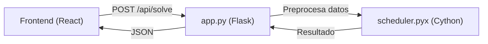

# Backend del Generador de Horarios - Documentación Técnica

Este documento describe la arquitectura, estructuras de datos y algoritmos del backend del generador de horarios universitarios, implementado en **Cython** para alto rendimiento.

---

## Tabla de Contenidos

1. [Arquitectura General](#arquitectura-general)
2. [Estructuras de Datos](#estructuras-de-datos)
3. [Algoritmos](#algoritmos)
4. [Restricciones Implementadas](#restricciones-implementadas)
5. [Optimizaciones](#optimizaciones)
6. [API](#api)

---

## Arquitectura General

El backend consta de dos componentes principales:

| Archivo | Tecnología | Propósito |
|---------|------------|-----------|
| `app.py` | Flask + Python | API REST, preprocesamiento de datos |
| `scheduler.pyx` | Cython | Motor de scheduling de alto rendimiento |



---

## Estructuras de Datos

### 1. Node (Nodo)

Representa una **hora-clase** que debe ser asignada. Cada materia con N horas semanales genera N nodos.

```python
cdef class Node:
    cdef public str id              # Identificador único: "grupo-materia-unidad"
    cdef public str grupo_id        # ID del grupo estudiantil
    cdef public str materia_id      # ID de la materia
    cdef public int unit_index      # Índice de la hora (0, 1, 2...)
    cdef public list possible_assignments  # Lista de tuplas (día, slot, profesor)
    cdef public int assigned_day    # Día asignado (-1 si no asignado)
    cdef public int assigned_slot   # Slot asignado (-1 si no asignado)
    cdef public int assigned_prof   # Índice del profesor asignado (-1 si no)
```

**Ejemplo**: Una materia "Cálculo" con 4 horas semanales para el grupo "ISC-1A" genera 4 nodos:
- `ISC-1A-calculo-0`
- `ISC-1A-calculo-1`
- `ISC-1A-calculo-2`
- `ISC-1A-calculo-3`

### 2. GraphScheduler (Planificador)

Es la clase principal que contiene el estado del problema y los algoritmos de resolución.

#### Matrices de Estado (NumPy, O(1) lookup)

| Matriz | Dimensiones | Propósito |
|--------|-------------|-----------|
| `prof_schedule` | `[num_profs][5][9]` | 1 si profesor ocupado en (día, slot), 0 si libre |
| `group_schedule` | `[num_grupos][5][9]` | 1 si grupo ocupado en (día, slot), 0 si libre |
| `prof_load` | `[num_profs]` | Carga actual de cada profesor (horas asignadas) |
| `prof_max_load` | `[num_profs]` | Carga máxima permitida por profesor |
| `group_materia_day_count` | `[grupos][materias][5]` | Horas de materia X asignadas al grupo Y en día Z |
| `group_materia_day_slots` | `[grupos][materias][5]` | Bitmask de slots ocupados (para contigüidad) |
| `prof_assignment` | `[grupos][materias]` | Profesor asignado a cada par grupo-materia |
| `prof_assignment_count` | `[grupos][materias]` | Contador para manejar deshacer asignaciones |

#### Mapeos (Diccionarios)

| Diccionario | Propósito |
|-------------|-----------|
| `prof_to_idx` | ID de profesor → índice numérico |
| `group_to_idx` | ID de grupo → índice numérico |
| `materia_to_idx` | ID de materia → índice numérico |
| `idx_to_prof_id` | Índice → ID de profesor (reverso) |

#### Variables de Control de Tiempo

| Variable | Tipo | Propósito |
|----------|------|-----------|
| `start_time` | `double` | Timestamp de inicio |
| `time_limit` | `double` | Límite en segundos |
| `call_count` | `long long` | Contador de llamadas recursivas |
| `time_limit_reached` | `bint` | Bandera de abort |

---

## Algoritmos

### 1. Algoritmo Greedy (Voraz)

**Complejidad**: O(N × A) donde N = número de nodos, A = asignaciones posibles por nodo.

```
Para cada nodo en orden:
    Para cada asignación posible (día, slot, profesor):
        Si es válida:
            Aplicar asignación
            Continuar al siguiente nodo
    Si ninguna es válida:
        Dejar nodo sin asignar (advertencia)
```

**Ventajas**: Rápido, determinista.
**Desventajas**: No backtrackea, puede quedarse atascado en óptimos locales.

### 2. Algoritmo Backtracking (Retroceso)

**Complejidad**: O(A^N) en el peor caso, pero con podas muy agresivas.

```
función backtrack(nodo_idx):
    # Control de tiempo cada 1000 llamadas
    Si time_limit_reached: retornar False
    Cada 1000 llamadas:
        Si tiempo > límite:
            Marcar time_limit_reached = True
            Retornar False
    
    # Guardar mejor solución parcial
    Si nodo_idx > max_assigned:
        Guardar snapshot de asignaciones actuales
    
    # Caso base
    Si nodo_idx >= total_nodos:
        Retornar True (¡éxito!)
    
    # Probar cada asignación posible
    Para cada (día, slot, profesor) en posibles:
        Si es válida:
            Aplicar asignación
            Si backtrack(nodo_idx + 1):
                Retornar True
            Si time_limit_reached:
                Deshacer y retornar False
            Deshacer asignación (backtrack)
    
    Retornar False (ninguna opción funcionó)
```

**Características clave**:

1. **Límite de tiempo configurable** (1-10 minutos)
2. **Guardado de mejor solución parcial**: Si no encuentra solución completa, devuelve la mejor encontrada
3. **Propagación de abort**: Cuando se acaba el tiempo, todas las llamadas recursivas se detienen inmediatamente

---

## Restricciones Implementadas

### Restricciones Duras (Hard Constraints)

Estas **deben cumplirse** obligatoriamente:

| # | Restricción | Validación |
|---|-------------|------------|
| 1 | **Profesor no ocupado** | `prof_schedule[prof][día][slot] == 0` |
| 2 | **Grupo no ocupado** | `group_schedule[grupo][día][slot] == 0` |
| 3 | **Carga máxima de profesor** | `prof_load[prof] < prof_max_load[prof]` |
| 4 | **Consistencia de profesor** | El mismo profesor debe dar todas las horas de una materia al mismo grupo |
| 5 | **Máximo 2 horas/día por materia** | `group_materia_day_count[g][m][d] < 2` |
| 6 | **Contigüidad de bloques** | Si hay 2 horas de una materia en un día, deben ser consecutivas |
| 7 | **Máximo gap de 1 hora** | No puede haber huecos mayores a 1 slot entre clases del grupo |
| 8 | **Máximo 7 horas/día por grupo** | Previene días excesivamente largos |

### Validación de Contigüidad (Restricción 6)

Usa un **bitmask** para tracking eficiente:

```python
# Si ya hay una hora asignada en el día...
if count > 0:
    mask = group_materia_day_slots[grupo][materia][día]
    # Verificar que el nuevo slot sea adyacente a alguno existente
    adj_mask = (1 << (slot - 1)) | (1 << (slot + 1))
    if (mask & adj_mask) == 0:
        return False  # No es contiguo
```

### Validación de Gaps (Restricción 7)

Escanea todos los slots del día para detectar huecos:

```python
last_slot = -1
for s in range(9):
    if slot_ocupado(s):
        if last_slot != -1:
            gap = s - last_slot - 1
            if gap > 1:
                return False  # Gap demasiado grande
        last_slot = s
```

---

## Optimizaciones

### 1. Preprocesamiento en Python (app.py)

Antes de llamar al scheduler, se aplican dos heurísticas:

#### a) Rotación de Días

```python
# Cada materia empieza a buscar en un día diferente
start_day_idx = materia_global_idx % 5
day_order = days_list[start_day_idx:] + days_list[:start_day_idx]
```

Esto distribuye la carga entre días, evitando que todas las materias llenen los lunes primero.

#### b) Round-Robin de Profesores

```python
# Rotar lista de profesores elegibles
prof_start_idx = (materia_global_idx + i) % len(eligible_profs)
eligible_profs = eligible_profs[prof_start_idx:] + eligible_profs[:prof_start_idx]
```

Evita que siempre se elija al primer profesor disponible, distribuyendo la carga.

### 2. Uso de NumPy/Cython

- Todas las matrices de estado son **numpy arrays tipados** (`int32`)
- Las funciones críticas están declaradas como `cdef` (C-level, sin overhead de Python)
- Acceso O(1) a todas las verificaciones de estado

### 3. Control de Tiempo Eficiente

- Solo verifica el reloj cada **1000 llamadas recursivas** para minimizar overhead
- Usa una bandera booleana `time_limit_reached` para abort inmediato

---

## API

### Endpoint: `POST /api/solve`

#### Request Body

```json
{
  "profesores": [
    {
      "id": "prof-1",
      "nombre": "Dr. García",
      "maxHoras": 20,
      "competencias": ["mat-calculo", "mat-algebra"],
      "disponibilidad": {
        "mon": { "s1": "available", "s2": "blocked", ... },
        ...
      }
    }
  ],
  "grupos": [
    {
      "id": "ISC-1A",
      "nombre": "ISC 1er Semestre A",
      "cuatrimestre": 1
    }
  ],
  "planDeEstudios": [
    {
      "id": "mat-calculo",
      "nombre": "Cálculo Diferencial",
      "horasSemana": 4,
      "cuatrimestre": 1
    }
  ],
  "algorithm": "backtracking",  // o "greedy"
  "timeLimit": 300  // segundos (5 minutos)
}
```

#### Response

```json
{
  "status": "ok",  // o "infeasible"
  "horarios": [
    {
      "grupoId": "ISC-1A",
      "bloques": [
        {
          "id": "ISC-1A-mat-calculo-0",
          "grupoId": "ISC-1A",
          "materiaId": "mat-calculo",
          "profesorId": "prof-1",
          "dia": "mon",
          "slotId": "s1",
          "duracion": 1
        }
      ],
      "metricas": { ... }
    }
  ],
  "resumen": {
    "mensaje": "Generado con Cython Backend",
    "tiempoMs": 1234,
    "violacionesDuras": 0
  },
  "advertencias": [
    "No se pudieron asignar 2 horas de Física al grupo ISC-2B"
  ]
}
```

---

## Estructura de Archivos

```
backend/
├── app.py              # API Flask, preprocesamiento
├── scheduler.pyx       # Motor Cython (se compila a .so)
├── scheduler.c         # Código C generado por Cython
├── scheduler.*.so      # Módulo compilado
├── setup.py            # Script de compilación
├── requirements.txt    # Dependencias Python
└── venv/               # Entorno virtual
```

---

## Compilación

```bash
# Crear entorno virtual
python3 -m venv venv
source venv/bin/activate

# Instalar dependencias
pip install -r requirements.txt

# Compilar Cython
python setup.py build_ext --inplace
```

O simplemente ejecutar `npm install` desde la raíz, que automáticamente corre `setup_backend.sh`.

---

## Ejecución

```bash
# Activar entorno
source backend/venv/bin/activate

# Iniciar servidor
python app.py
# → Servidor en http://localhost:5000
```

O usar `npm start` que inicia todo (frontend + backend) simultáneamente.
